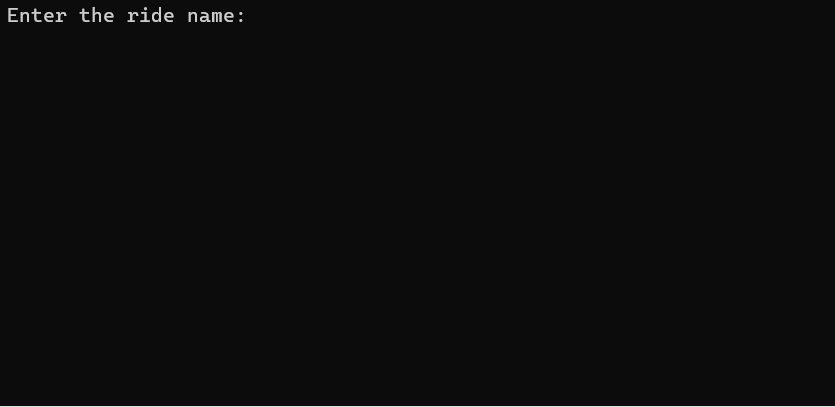
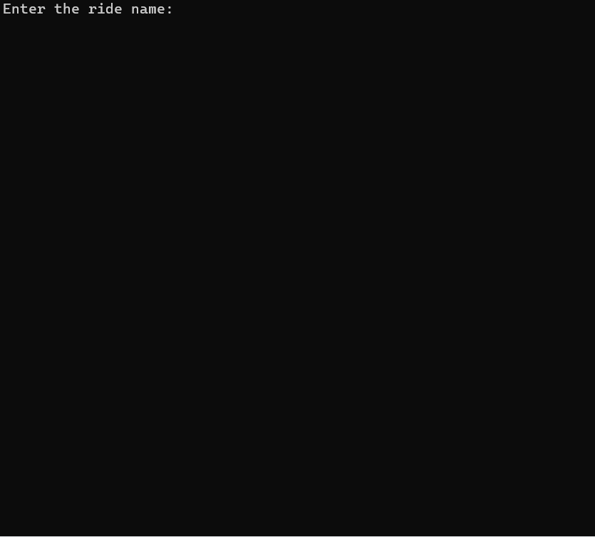

# Fall 2025 Assignment 04 - Working with Custom Objects
__Weight:__ 20% of final mark

__Submission requirements__: On or before the due date, submit a Visual Studio 2022 project as per your instructor's direction. It is your responsibility to ensure your work is submitted as expected. Work that is not submitted will not be graded.

# 🎡 Context
You’ve been hired by the local amusement park Thrilladelphia to help modernize their aging ride-tracking system. Their current method involves sticky notes, walkie-talkies, and a suspiciously large binder.

Your job? Build a simple C# console program that lets staff store and manage details about each ride. They should be able to track how thrilling each ride is, how many visitors it’s had today, and how profitable—or terrifying—it might be.

## 🔨 Requirements
The program build is developed in two parts:

### Part A – Class and Object Implementation: the `Ride` Class 🚀

Design a class named `Ride` that meets the following requirements:

- A `string` field to store the ride’s **name** and a corresponding `Name` property with both `get` and `set` functionality.
  - This field cannot be empty, null, or whitespace. Ensure that the stored value is trimmed of leading and trailing whitespace.
- An `int` field for **fright factor** and a corresponding `FrightFactor` property with both `get` and `set` functionality.
  - The fright factor must be between 0 and 100.
- A `double` field for the **cost** to enter and a `CostToEnter` property with both `get` and `set` functionality.
  - The cost must be at least 1.00.
- An `int` field for **visitors** today and a `VisitorsToday` property with both `get` and `set` functionality.
  - The value for this field must be 0 or greater.
- A **default constructor**.
- A [**greedy constructor**](https://dagilleland.hashnode.dev/greedy-constructors)  that requires the name, fright factor, cost, and number of visitors as parameters.
  - Use the properties in the constructor for setting the fields to take advantage of any validation checks already coded.
- A read-only property named `PopularityScore` that returns as a `double` the calculated score, using the following formula:
  `(FrightFactor / 10.0) * VisitorsToday`
- A read-only property named `ThrillLevel` that will return as a `string` the thrill level based on the `FrightFactor` value.
  | Fright Factor |	Thrill Level |
  | ------------- | ------------ |
  | 0–20          |	Mild         |
  | 21–60	        | Exciting     |
  | 61–90	        | Thrilling    |
  | 91–100	      | Extreme      |
- A `public` method named `RideDetails()` that returns a `string` with the Name, Fright Factor, Cost, Visitors, Thrill Level, and Popularity Score with labels and appropriate padding.
- Challenge (not for marks): A `public` method called `ToCSVString()` that returns the `Name`, `FrightFactor`, `CostToEnter`, & `VisitorsToday` as **comma-separated values**.
  > Hint: This can help simplify your method for writing to a file.
- Challenge (not for marks): Override the `ToString()` method to output `Name FrightFactor CostToEnter VisitorsToday` with clean padding. For example:
  `DoomDrop     95        6.00         520`

After creating your `Ride` class, write a program to test the class as shown in the sample run below. The program, must, **at a minimum**, demonstrate the following:

- a. prompt for a `string`
- b. prompt for an `int`
- c. prompt for a `double`
- d. create an instance of `Ride` from user input
- e. display either the popularity score, the thrill level, or full ride details **depending on user input**.
- f. have appropriate **error handling** (i.e. the program must not crash)

#### Sample Program Run (Part A implementation)
_NOTE: the sample run does not demonstrate exception handling, ensure your program handles exceptions gracefully and does not crash._

#### Successful run



#### Validation run



> After completing Part A, submit your code for written feedback, and/or review with your instructor in a work period.


### Part B – Ride List + Menu-Driven Program 🎪
Once your base functionality is complete, you will improve on the program developed in Part A by adding the following features (_NOTE: this is not a new program, update the program from Part A to be a more robust and functional program._):

- The program should make use of **file storage** (specifically, a CSV file) to store Rides.
  - The ordering of fields for the CSV file is up to you, and the file must be in an acceptable CSV format.
  - **When the program begins**, load each ride from the file as a `Ride` object and store them in a `List`. 
- Any rides **added** to the program must be added to the list of rides.
  > Note: duplicate ride names are not allowed.
- Any rides **removed** from the program must be removed from the list of rides.
- Any changes made to the ride details (fright factor, cost, or # of guests) must be **saved** to the appropriate item in the list.
- Allow the user to **search** for a ride by name (case-insensitive), then display all details for that ride.
- Allow the user to **view all** the rides in the `List`.
- When the program ends, **write** the `List` of rides to the file.

Stretch Goals [Optional]
- Keep the list/file sorted in alphabetical order by ride name.

An **example** of what your main menu options could be:
```
Display All Rides
Search for a Ride by Name
Add a New Ride
Edit a Ride
Remove a Ride
Quit and Save
```

You must use a modular approach to your solution: utilize previous work and in-class examples to help with this task.

Think carefully about how you will structure this program and consider the user experience when implementing it.

#### Successful run

___There are no sample program runs for Part B, you're on your own.___

------

__Aside from what’s been presented in this document, do not make **any** assumptions. Seek clarity from your instructor if you do not understand something in this document.__

------

## 🎢 Coding Requirements
__NOTE:__ the following requirements are expected and you will not receive corrective feedback prior to the submission deadline if any of the following are unmet.

- A C# comment block at the beginning of the source file describing the purpose, author, and last modified date of the program.
- Write only one statement per line.
- You must use a `List` for storing Rides in your solution.
- Use camelCase for local variable names.
- Use UPPER_SNAKE_CASE for constant variable names.
- Use defensive programming where necessary, including input validation on all user inputs.
- Ensure graceful handling of all exceptions.
- Include summary comments for all defined methods.

## 🎠 Submission
Commit and push your solution as per your instructor's direction, on or before the due date. Ensure that your solution follows the best coding and style practices, as your instructor has shown you in class. Failed adherence to the prescribed style guidelines may result in lost marks. __Your program must compile; a program that fails to compile will not be graded.__

_NOTE: submit early and often to receive feedback from your instructor prior to the due date. Your instructor will not be providing feedback for every commit every day. However, the earlier and more often you commit, the greater the chances of your instructor reviewing your work and providing constructive feedback that you can act on before the due date._

## Rubric [30 Marks Total]

### Part A [12 Marks - Class and Object Implementation]

| Criteria |  Good (3 marks) | Acceptable (2 marks) | Needs Work (1 mark) | Unsatisfactory (0 marks)
|-|-|-|-|-|
| Fields & Properties | All fields & properties are created with the expected visibility, data type, and validation. | 1-2 minor errors in fields & properties. | Missing fields, validation, or other significant errors. | Fewer than half of the fields/properties were created. |
| Methods | Constructors & methods created as specified. | 1-2 minor errors in methods. | Validators do not use existing validation checks, missing constructor/method, or other significatnt errors. | No methods were written. |
| Part A Program | Program prompts for `string`, `int`, `double`, creates an instance, and allows the user to choose to display thrill level and/or popularity score, without crashing. | 1-2 missed requirements. | At least half of these tasks were complete. | Fewer than half can be directly tested. |
| Part A Testing | Program passes all test cases. | Program passes more than half of the test cases. | Program passes fewer than half of the test cases. | Program does not pass any tests. |


### Part B [12 Marks - Extended Program Completion]
| Criteria |  Good (3 marks) | Acceptable (2 marks) | Needs Work (1 mark) | Unsatisfactory (0 marks)
|-|-|-|-|-|
|File I/O|Read/write as per program specs, acceptable file format was used, defensive programming was implemented and program does not crash, and sample test file provided. |Minor errors in file format, program crashes during file I/O in some cases, or missing sample file.|Significant issues with file format, or defensive programming is not applied.|Errors during file I/O crash program, required format isn't implemented, or code not written.|
| `List` | `List` is correctly written to and updated throughout program run, including adding, editing, and removing elements. | 1-2 minor errors. | Significant errors in `List` implementation. | Lists are not implemented, or unable to add, remove, and edit elements. |
| Part B Functionality | User can view ride details, view all rides, and search for a specific ride.  Menu-driven program which loops until the user chooses to exit. | 1-2 minor errors. | Significant errors or missing functionality. | Functionality is not attempted. |
| Part B Testing | All tests pass. | Most tests pass. | Some tests pass. | No tests pass.

Generative AI is not permitted for this assignment: suspected uses of academic misconduct will be investigated following the NAIT Academic Integrity policy and Academic Misconduct procedure and may result in a grade of zero.


### Documentation & Best Practices [6 marks]
| Criteria |  Good (3 marks) | Acceptable (2 marks) | Needs Work (1 mark) | Unsatisfactory (0 marks)
|-|-|-|-|-|
| Documentation |All methods correctly & fully documented in XML format.|Most methods are documented.|Fewer than half of methods are documented.|Documentation is not completed.|
| Best practices | Code follows course best practices including good naming conventions, properly aligned output, opening comment block, appropriate use of comments, and minimizes redundant code. | 1-2 minor errors or violations. | 3+ errors or standard violations. | No alignment, documentation, or appropriate names.
